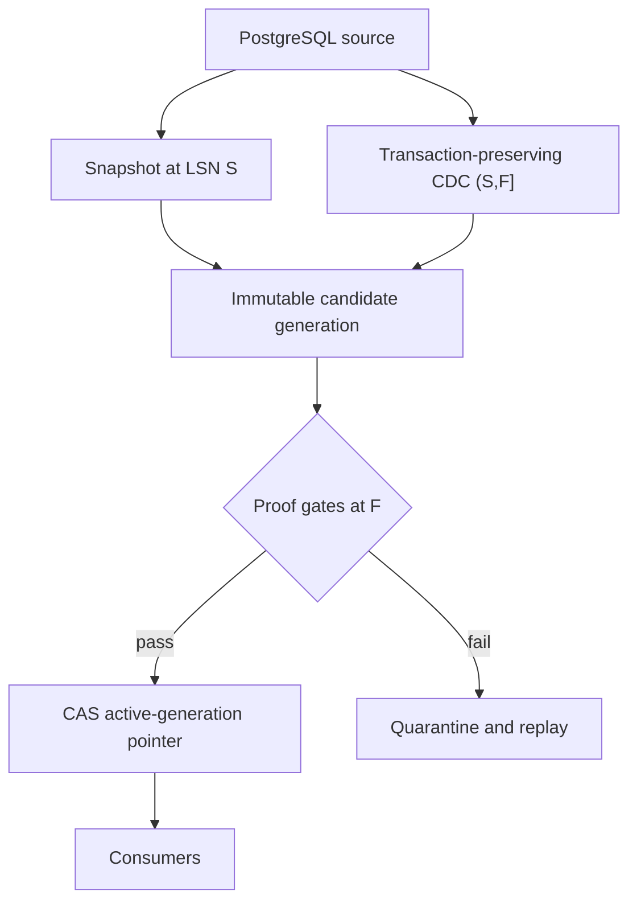

# ChangeBridge — CDC Migration Platform

[](https://github.com/bhuvaneshwaranmurugan21/changebridge-cdc-migration-platform/actions/workflows/ci.yml)
[](https://github.com/bhuvaneshwaranmurugan21/changebridge-cdc-migration-platform/actions/workflows/terraform.yml)

ChangeBridge is an opinionated control plane for migrating mutable PostgreSQL workloads into
an Apache Iceberg lakehouse without treating “DMS task is running” as proof of correctness.
It binds a consistent snapshot, an explicit CDC frontier, reconciliation evidence, cutover,
and rollback to one immutable **migration generation**.

The repository is deliberately split into two truth levels:

- **Executable and verified locally:** replay identity, contiguous LSN frontiers, deletes,
  atomic failure rollback, schema gates, reconciliation, cutover CAS, and deterministic evidence.
- **Production-shaped but not yet verified on AWS:** DMS → S3, Glue/Iceberg, Step Functions,
  DynamoDB control state, KMS, IAM, and CloudWatch Terraform.

No cloud throughput, availability, or cost claim is made without a captured AWS run.

## The architecture opinion

Most migrations combine a snapshot and a CDC stream but leave their boundary implicit.
ChangeBridge makes that boundary a first-class, testable object:

```text
Generation = snapshot at LSN S + ordered CDC interval (S, F] + proof at F
```

Consumers never read a half-built candidate. They resolve a single versioned pointer to an
active generation. Cutover is a compare-and-swap operation allowed only when schema,
reconciliation, lag, pre-migration, and rollback gates all pass.



### What it changes in three mainstream patterns

| Common pattern | Normalized failure | ChangeBridge correction |
|---|---|---|
| Snapshot plus dual-write/CDC | Snapshot/stream gap is hidden in orchestration state | Snapshot LSN and every subsequent half-open frontier are persisted and checked |
| Medallion CDC merge | Partial candidate tables become visible; replay semantics vary by job | One immutable generation plus transaction digests and an atomic consumer pointer |
| Log-centric/Kappa rebuild | Correctness is assumed from retention and offsets; cutover is operational | Bounded generations, table digests, explicit quality gates, and pointer rollback |

ChangeBridge does not replace DMS, Debezium, Kafka, or Iceberg. It treats them as transports
and storage engines while owning migration correctness in a small control plane.

## Invariants

1. A generation starts from exactly one source snapshot frontier.
2. CDC batches form a contiguous chain `(current_lsn, next_lsn]`.
3. A transaction ID replay is valid only when its canonical payload digest is unchanged.
4. Deletes remain auditable tombstones; they are not silently dropped.
5. A failed batch advances neither data nor the generation frontier.
6. Breaking schema changes quarantine a generation.
7. Reconciliation is count **and** canonical row digest at the same frontier.
8. Only a ready generation can become active.
9. Active generation changes use compare-and-swap, preventing lost cutovers.
10. Rollback is a pointer transition to a retained proven generation, not a reverse mutation.

## Run it

Requires Python 3.11+.

```bash
python -m venv .venv
source .venv/bin/activate
python -m pip install -e '.[dev]'
pytest
python -m changebridge.cli simulate --output evidence/local-simulation.json
```

The deterministic failure lab proves 13 scenarios, including an injected crash, duplicate
replay, conflicting replay, a frontier gap, delete propagation, incompatible schema, a
source/target mismatch, excessive lag, successful cutover, and stale concurrent cutover.

## Repository map

```text
src/changebridge/   transport-neutral correctness kernel
tests/              invariant and failure-injection tests
contracts/          versioned source contracts
jobs/               production-shaped Spark adapter
infra/terraform/    AWS reference topology
evidence/           reproducible local proof artifact
docs/               architecture decisions, runbook, and claim registry
```

## Production mapping

| Correctness concept | Local oracle | AWS reference component |
|---|---|---|
| Snapshot + CDC frontier | SQLite generation record | DMS checkpoint + DynamoDB generation ledger |
| Immutable candidate | Generation-scoped records | S3 + Iceberg generation namespace |
| Transaction replay identity | SHA-256 canonical payload | Manifest digest and transaction ledger |
| Reconciliation proof | Counts and canonical row digests | Glue/Spark proof job + immutable S3 evidence |
| Cutover CAS | SQLite conditional update | DynamoDB conditional write |
| Observability | JSON failure-lab artifact | CloudWatch logs, metrics, alarms, run ID |

AWS DMS supports PostgreSQL CDC and transaction-preserving S3 output; Iceberg provides
snapshots and schema evolution. Their capabilities are inputs to this design, not a substitute
for its end-to-end correctness gates. See the primary references in [Architecture](docs/architecture.md).

## Interview walkthrough

Start with the failure being prevented, not the services: “A snapshot and CDC stream can both
succeed while the target is still incomplete.” Draw `S`, `(S,F]`, and the active pointer.
Then demonstrate `make evidence`, inspect the failed gates, and explain how the same invariants
map to DMS/Iceberg/DynamoDB. Be explicit that the AWS topology is production-shaped, with static
CI validation and a real managed-service run still required before making a runtime claim.

## Current evidence boundary

See [claims.yaml](docs/claims.yaml). Local evidence is reproducible. A real AWS execution with
task ARNs, DMS checkpoint, Iceberg snapshot IDs, CloudWatch links, measured runtime/cost,
failure injection, recovery, and teardown remains intentionally unclaimed.

## License

MIT
