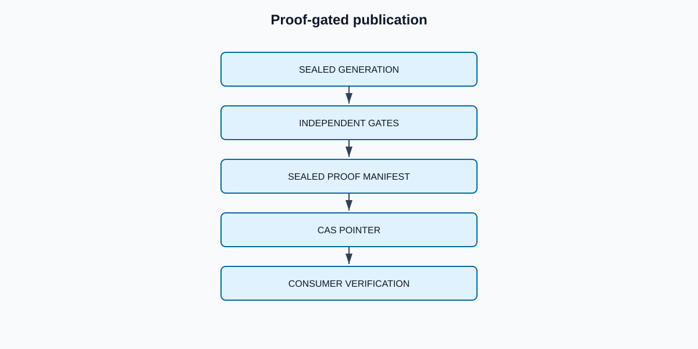

# ChangeBridge — CDC Migration Platform

[](https://github.com/bhuvaneshwaranmurugan21/changebridge-cdc-migration-platform/actions/workflows/ci.yml)
[](https://github.com/bhuvaneshwaranmurugan21/changebridge-cdc-migration-platform/actions/workflows/terraform.yml)

ChangeBridge is an opinionated control plane for migrating mutable PostgreSQL workloads into
an Apache Iceberg lakehouse without treating “DMS task is running” as proof of correctness.
It binds a consistent snapshot, an explicit CDC frontier, reconciliation evidence, cutover,
and rollback to one immutable **migration generation**.

The repository is deliberately split into explicit evidence levels:

<!-- claim:CB-CLAIM-001 -->
The SQLite reference engine locally verifies contiguous frontiers, identical replay, conflicting
replay rejection, tombstones, failure rollback, schema gates, reconciliation, and
compare-and-swap publication.

<!-- claim:CB-CLAIM-002 -->
The repository contains an accepted design-only architecture authority and a partial AWS
reference topology; it does not contain a complete deployable migration platform or managed
runtime proof.

<!-- claim:CB-CLAIM-003 -->
ChangeBridge makes no AWS throughput, availability, recovery-time, scale, or cost claim because
no qualifying managed measurement exists.

## The architecture opinion

Most migrations combine a snapshot and a CDC stream but leave their boundary implicit.
ChangeBridge makes that boundary a first-class, testable object:

```text
Generation = snapshot at LSN S + ordered CDC interval (S, F] + proof at F
```

<!-- claim:CB-CLAIM-004 -->
The local reference engine prevents publication before its modeled gates pass and changes the
active generation through a versioned compare-and-swap pointer. The managed multi-table behavior
is still design-only; this is not a claim of atomic transactions across Iceberg tables.



The complete component, lifecycle, checkpoint-recovery, proof, publication, reader-pinning,
rollback, and retirement semantics are defined by the
[Stage 3 architecture authority](docs/architecture.md) and its fifteen accepted ADRs.

Stage 4 makes those decisions machine-checkable through the
[contract catalog](docs/contracts/CONTRACT_CATALOG.md),
[canonicalization profile](docs/contracts/CANONICALIZATION.md), twelve control-record schemas,
[sixteen invariant oracles](docs/testing/INVARIANT_ORACLES.md), and the
[layered test authority](docs/testing/TEST_ARCHITECTURE.md). These are bounded local specification
and reference-oracle proofs. They do not change the existing runtime adapters or establish AWS,
performance, availability, exactly-once, or zero-downtime behavior.

### What it changes in three mainstream patterns

| Common pattern | Normalized failure | ChangeBridge correction |
|---|---|---|
| Snapshot plus dual-write/CDC | Snapshot/stream gap is hidden in orchestration state | Snapshot LSN and every subsequent half-open frontier are persisted and checked |
| Medallion CDC merge | Partial candidate tables become visible; replay semantics vary by job | One immutable generation plus transaction digests and an atomic consumer pointer |
| Log-centric/Kappa rebuild | Correctness is assumed from retention and offsets; cutover is operational | Bounded generations, table digests, explicit quality gates, and pointer rollback |

ChangeBridge does not replace DMS, Debezium, Kafka, or Iceberg. It treats them as transports
and storage engines while owning migration correctness in a small control plane.

## Invariants

1. A generation starts from exactly one source snapshot frontier.
2. CDC batches form a contiguous chain `(current_lsn, next_lsn]`.
3. A transaction ID replay is valid only when its canonical payload digest is unchanged.
4. Deletes remain auditable tombstones; they are not silently dropped.
5. A failed batch advances neither data nor the generation frontier.
6. Breaking schema changes quarantine a generation.
7. Reconciliation is count **and** canonical row digest at the same frontier.
8. Only a ready generation can become active.
9. Active generation changes use compare-and-swap, preventing lost cutovers.
10. Rollback must be an authorized pointer transition to a retained proven generation, not a
    reverse mutation.

<!-- claim:CB-CLAIM-009 -->
Rollback now has an accepted design-only eligibility and publication contract, while the local
engine still provides only a generic compare-and-swap activation primitive; no explicit rollback
API, consumer-resolution scenario, or managed rollback proof exists.

## Run it

Requires Python 3.11+.

```bash
python -m venv .venv
source .venv/bin/activate
python -m pip install -e '.[dev]'
pytest
python -m changebridge.cli simulate --output evidence/local-simulation.json
```

<!-- claim:CB-CLAIM-005 -->
The deterministic local failure laboratory executes 13 named checks and reproduced byte-for-byte
at the Stage 1 merged commit. The lab includes an injected crash, duplicate replay, conflicting
replay, a frontier gap, delete propagation, incompatible schema, a source/target mismatch,
excessive lag, successful cutover, and stale concurrent cutover.

## Repository map

```text
src/changebridge/   transport-neutral correctness kernel
tests/              invariant and failure-injection tests
contracts/          versioned source contracts
oracles/            invariant-to-oracle authority
testing/            machine-readable test-layer authority
jobs/               Spark interface/input-shape adapter; no Iceberg mutation
infra/terraform/    AWS reference topology
evidence/           reproducible local proof artifact
docs/               architecture decisions, runbook, and claim registry
```

## Production mapping

<!-- claim:CB-CLAIM-006 -->
The current Spark file is an interface and input-shape adapter: it validates five columns and
counts rows, but performs no Iceberg write, MERGE, delete application, checkpoint coupling, or
idempotent target transaction.

| Correctness concept | Local oracle | AWS reference component |
|---|---|---|
| Snapshot + CDC frontier | SQLite generation record | DMS checkpoint + DynamoDB generation ledger |
| Immutable candidate | Generation-scoped records | S3 + Iceberg generation namespace |
| Transaction replay identity | SHA-256 canonical payload | Manifest digest and transaction ledger |
| Reconciliation proof | Counts and canonical row digests | Glue/Spark proof job + immutable S3 evidence |
| Cutover CAS | SQLite conditional update | DynamoDB conditional write |
| Observability | JSON failure-lab artifact | CloudWatch logs, metrics, alarms, run ID |

<!-- claim:CB-CLAIM-008 -->
Terraform is a partial design artifact whose formatting and validation have historical CI
evidence; it is not managed deployment or end-to-end infrastructure proof.

AWS DMS supports PostgreSQL CDC and transaction-preserving S3 output; Iceberg provides
snapshots and schema evolution. Their capabilities are inputs to this design, not a substitute
for its end-to-end correctness gates. See the primary references in [Architecture](docs/architecture.md).

## Interview walkthrough

Start with the failure being prevented, not the services: “A snapshot and CDC stream can both
succeed while the target is still incomplete.” Draw `S`, `(S,F]`, and the active pointer.
Then demonstrate `make evidence`, inspect the failed gates, and explain how the same invariants
map to DMS/Iceberg/DynamoDB. Be explicit that the AWS topology is production-shaped, with static
CI validation and a real managed-service run still required before making a runtime claim.

## Current evidence boundary

See the authoritative [claim registry](CLAIMS.md) and
[completion contract](COMPLETION_CONTRACT.md).

<!-- claim:CB-CLAIM-011 -->
A deterministic workload was executed in isolated PostgreSQL 17.11 schemas, and a real exported
logical snapshot was locally bound to one typed PostgreSQL LSN frontier; repeated same-seed runs
matched logically while their physical LSNs remained run-specific.
This is local source-boundary proof only; it is not AWS DMS, target-apply, performance, or
production-readiness proof. See the [Stage 1 authority](docs/part2/stage1/SOURCE_BOUNDARY.md).

<!-- claim:CB-CLAIM-010 -->
Stage 1 reproduced the committed local simulation byte-for-byte and bound that verification to
merged main; the older simulation payload itself still lacks embedded commit, command, and tool
provenance. A real AWS execution with task ARNs, DMS checkpoint, Iceberg snapshot IDs, CloudWatch
links, measured runtime/cost, failure injection, recovery, and teardown remains intentionally
unclaimed.

## License

MIT
