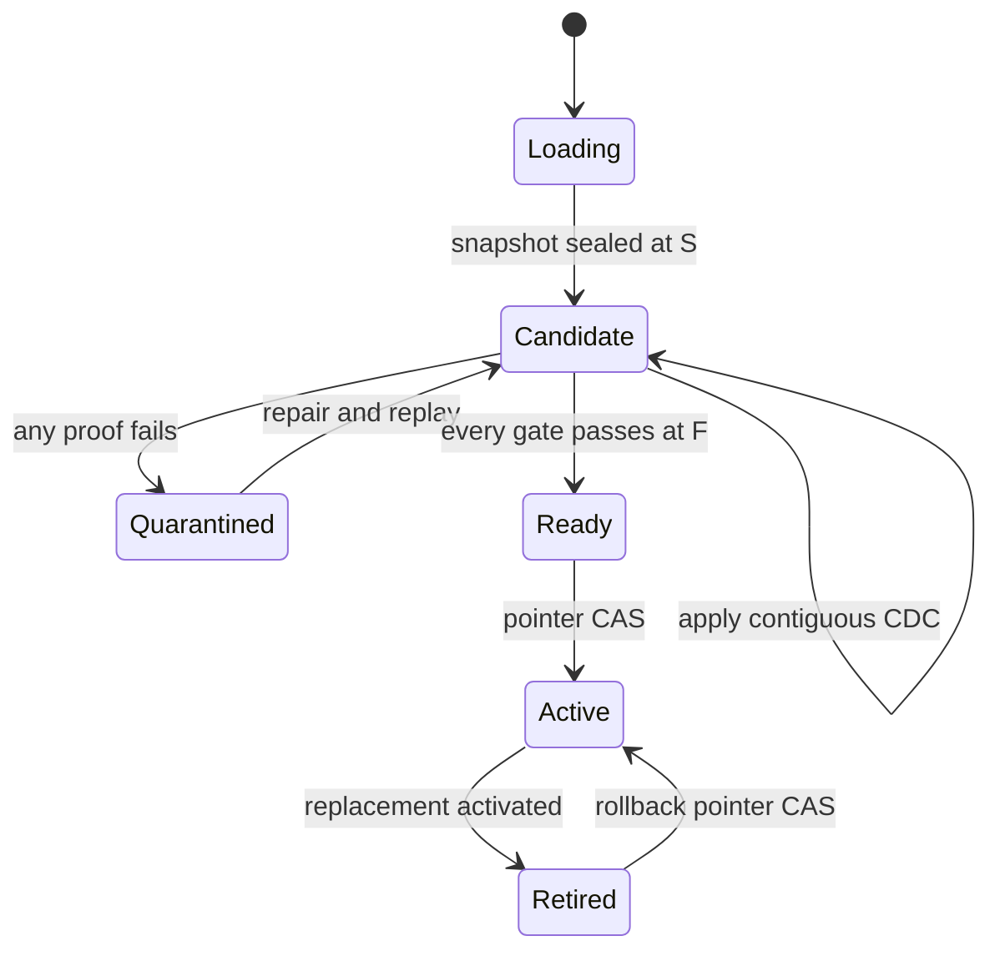

# Architecture decision record

## Decision

Adopt **frontier-bound migration generations**. A generation is the smallest unit that can be
reconciled, activated, rolled back, retained, or destroyed. It contains:

- source identity and schema digest;
- consistent snapshot frontier `S`;
- immutable transaction-preserving CDC manifests covering `(S,F]`;
- candidate Iceberg snapshot IDs;
- table-level reconciliation proofs at `F`;
- gate results and a terminal decision.

The active data product is resolved through a strongly consistent versioned pointer. Table
paths never become the cutover mechanism.

## Why not trust transport offsets?

An offset proves that a reader progressed. It does not prove that every source row is in the
candidate, that deletes were preserved, that a schema change was safe, or that every target
table represents the same business frontier. The control plane therefore verifies semantic
state at a declared frontier before publication.

## State machine

## Production data path

1. PostgreSQL logical replication exposes committed changes.
2. AWS DMS captures the full load and CDC, with transaction-preserving output enabled.
3. Raw S3 objects are immutable and named by run/generation.
4. A manifest validator checks checksum, schema digest, transaction boundary, and LSN interval.
5. Glue/Spark applies a manifest into generation-scoped Iceberg tables.
6. Reconciliation runs at a frozen source/target frontier and writes immutable evidence.
7. Step Functions asks the gate evaluator for a decision.
8. DynamoDB conditionally swaps the active pointer. Consumers resolve that pointer.

## Failure containment

- A missing interval stops ingestion with the previous frontier intact.
- Duplicate identical transactions are no-ops; conflicting duplicates are quarantined.
- A worker crash before commit changes neither frontier nor data.
- A breaking contract cannot reach the candidate table.
- A stale cutover command loses the conditional write.
- The previous proven generation remains available for pointer rollback.

## Primary references

- [AWS DMS: using PostgreSQL as a source](https://docs.aws.amazon.com/dms/latest/userguide/CHAP_Source.PostgreSQL.html)
- [AWS DMS S3 target settings, including transaction order](https://docs.aws.amazon.com/dms/latest/userguide/CHAP_Target.S3.html)
- [Debezium PostgreSQL connector snapshots and offsets](https://debezium.io/documentation/reference/stable/connectors/postgresql.html)
- [Apache Iceberg reliability and snapshots](https://iceberg.apache.org/docs/latest/reliability/)
- [Apache Iceberg schema evolution](https://iceberg.apache.org/docs/latest/evolution/)
- [DynamoDB conditional operations](https://docs.aws.amazon.com/amazondynamodb/latest/developerguide/Expressions.ConditionExpressions.html)
