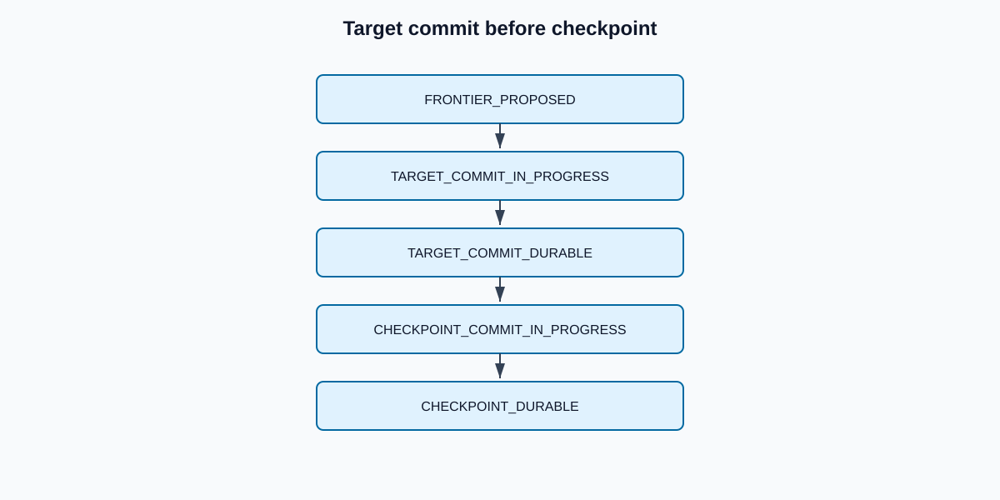

# Target commit and checkpoint recovery

The machine-readable authority is `architecture/checkpoint-state-machine.json`.

ChangeBridge does not claim one ACID transaction across Iceberg and an external checkpoint ledger. Safety comes from deterministic target commit identity, durable target receipts, monotonic conditional checkpoint writes, and explicit reconciliation of ambiguous acknowledgements.

The checkpoint can advance only after a durable target receipt binds the same generation and frontier. If a target or checkpoint request times out, recovery queries both authoritative systems before retrying. An unresolved target outcome is `FAILED_SAFE`: no blind replay and no speculative checkpoint advancement.

Restart begins from the last frontier mutually established by target receipt and checkpoint ledger. The exact managed Iceberg/DynamoDB receipt protocol remains unimplemented and must be proven later.
