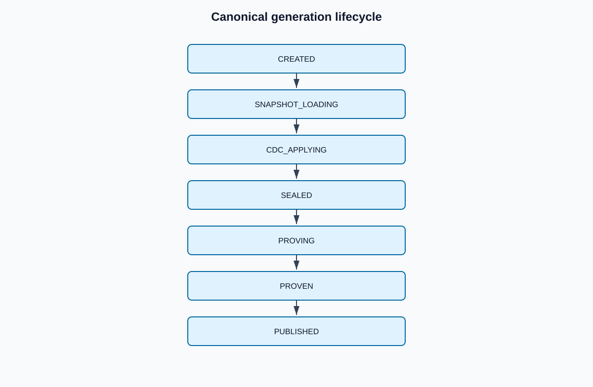

# Generation lifecycle

The machine-readable authority is `architecture/generation-state-machine.json`.

`PUBLISHED` records successful publication history. It does not by itself mean “currently active”; only the versioned active-generation pointer determines current consumer visibility. A generation may remain `PUBLISHED` after replacement while retained for rollback.

Candidate data is mutable only during `SNAPSHOT_LOADING` and `CDC_APPLYING` inside its isolated namespace. Successful sealing freezes the candidate table map, frontier, and input digests. No apply transition exists after `SEALED`.

`REJECTED` and `RETIRED` are terminal. Repair, replay requiring changed semantics, or reuse creates a successor generation with lineage and independent proof. `ROLLED_BACK` records withdrawal of a published generation and may proceed only to retirement.
