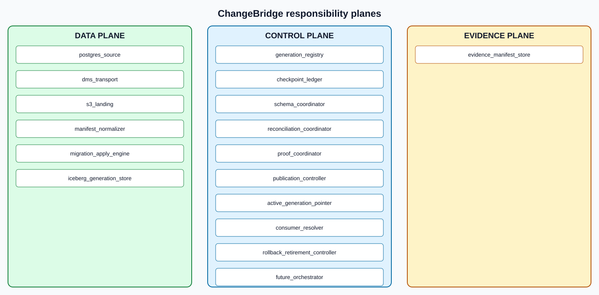

# Responsibility model

This view is generated from `architecture/components.json`.
The machine-readable file is authoritative.

Transport moves records, storage holds data, the control plane decides
correctness and publication, and the evidence plane records defensible claims.

## Data plane

### `postgres_source`

Own source rows, transaction boundaries, and comparable PostgreSQL WAL positions.

- Implementation: `EXTERNAL_UNVERIFIED`
- Does not own: migration completeness, target durability, publication
- Retry boundary: retry only after resolving the authoritative prior outcome
- Failure: `POSTGRES_SOURCE_FAILED`; fail closed; preserve inputs, decision context, and evidence
- Requirements: `CB-BOUNDARY-001`, `CB-BOUNDARY-003`, `CB-RECON-001`

### `dms_transport`

Transport full-load and CDC records while preserving configured transaction metadata.

- Implementation: `PARTIAL_TERRAFORM`
- Does not own: migration correctness, reconciliation, proof, publication
- Retry boundary: retry only after resolving the authoritative prior outcome
- Failure: `DMS_TRANSPORT_FAILED`; fail closed; preserve inputs, decision context, and evidence
- Requirements: `CB-BOUNDARY-002`, `CB-ORDER-004`, `CB-OPS-002`

### `s3_landing`

Retain immutable generation-scoped raw objects and their transport lineage.

- Implementation: `PARTIAL_TERRAFORM`
- Does not own: event normalization, target apply, proof verdicts
- Retry boundary: retry only after resolving the authoritative prior outcome
- Failure: `S3_LANDING_FAILED`; fail closed; preserve inputs, decision context, and evidence
- Requirements: `CB-ORDER-004`, `CB-EVIDENCE-001`, `CB-SEC-001`

### `manifest_normalizer`

Validate raw manifests and emit one canonical transport-neutral CDC envelope.

- Implementation: `UNIMPLEMENTED`
- Does not own: source extraction, target mutation, checkpoint publication
- Retry boundary: retry only after resolving the authoritative prior outcome
- Failure: `MANIFEST_NORMALIZER_FAILED`; fail closed; preserve inputs, decision context, and evidence
- Requirements: `CB-ORDER-001`, `CB-ORDER-003`, `CB-ORDER-004`

### `migration_apply_engine`

Apply ordered canonical transactions idempotently into one isolated candidate generation.

- Implementation: `LOCAL_REFERENCE`
- Does not own: transport acquisition, proof aggregation, publication
- Retry boundary: retry only after resolving the authoritative prior outcome
- Failure: `MIGRATION_APPLY_ENGINE_FAILED`; fail closed; preserve inputs, decision context, and evidence
- Requirements: `CB-APPLY-001`, `CB-APPLY-002`, `CB-APPLY-003`, `CB-APPLY-004`, `CB-APPLY-005`

### `iceberg_generation_store`

Store generation-scoped candidate tables and durable snapshot identifiers.

- Implementation: `DESIGN_ONLY`
- Does not own: source coverage, cross-table atomicity, publication decision
- Retry boundary: retry only after resolving the authoritative prior outcome
- Failure: `ICEBERG_GENERATION_STORE_FAILED`; fail closed; preserve inputs, decision context, and evidence
- Requirements: `CB-ISOLATION-001`, `CB-ISOLATION-002`, `CB-CHECKPOINT-001`

## Control plane

### `generation_registry`

Own lifecycle state, revision, parent/successor lineage, and immutable generation identity.

- Implementation: `PARTIAL_TERRAFORM`
- Does not own: target data, proof computation, active consumer resolution
- Retry boundary: retry only after resolving the authoritative prior outcome
- Failure: `GENERATION_REGISTRY_FAILED`; fail closed; preserve inputs, decision context, and evidence
- Requirements: `CB-ISOLATION-001`, `CB-EVIDENCE-001`

### `checkpoint_ledger`

Own the monotonic mutually-established source/target frontier and ambiguity recovery state.

- Implementation: `LOCAL_REFERENCE`
- Does not own: target data commit, transport delivery
- Retry boundary: retry only after resolving the authoritative prior outcome
- Failure: `CHECKPOINT_LEDGER_FAILED`; fail closed; preserve inputs, decision context, and evidence
- Requirements: `CB-CHECKPOINT-001`, `CB-CHECKPOINT-002`, `CB-CHECKPOINT-003`

### `schema_coordinator`

Own versioned schema identity and fail-closed compatibility decisions.

- Implementation: `LOCAL_REFERENCE`
- Does not own: data transport, target mutation, schema deployment
- Retry boundary: retry only after resolving the authoritative prior outcome
- Failure: `SCHEMA_COORDINATOR_FAILED`; fail closed; preserve inputs, decision context, and evidence
- Requirements: `CB-SCHEMA-001`, `CB-SCHEMA-002`, `CB-SCHEMA-003`

### `reconciliation_coordinator`

Bind frozen source and candidate observations to the same frontier and compute hierarchical proof.

- Implementation: `LOCAL_REFERENCE`
- Does not own: source freeze mechanism, publication
- Retry boundary: retry only after resolving the authoritative prior outcome
- Failure: `RECONCILIATION_COORDINATOR_FAILED`; fail closed; preserve inputs, decision context, and evidence
- Requirements: `CB-RECON-001`, `CB-RECON-002`, `CB-RECON-003`

### `proof_coordinator`

Collect independent frontier-bound gate records and seal one immutable proof manifest.

- Implementation: `DESIGN_ONLY`
- Does not own: inventing evidence, managed capability verification, publication
- Retry boundary: retry only after resolving the authoritative prior outcome
- Failure: `PROOF_COORDINATOR_FAILED`; fail closed; preserve inputs, decision context, and evidence
- Requirements: `CB-PUBLISH-001`, `CB-OPS-001`, `CB-EVIDENCE-001`

### `publication_controller`

Validate proof eligibility and issue one expected-revision publication attempt.

- Implementation: `LOCAL_REFERENCE`
- Does not own: proof creation, consumer query execution, cross-table transactions
- Retry boundary: retry only after resolving the authoritative prior outcome
- Failure: `PUBLICATION_CONTROLLER_FAILED`; fail closed; preserve inputs, decision context, and evidence
- Requirements: `CB-PUBLISH-001`, `CB-PUBLISH-002`, `CB-PUBLISH-003`

### `active_generation_pointer`

Own the strongly consistent product-to-generation mapping and monotonically increasing revision.

- Implementation: `PARTIAL_TERRAFORM`
- Does not own: generation proof, table storage, reader caching policy
- Retry boundary: retry only after resolving the authoritative prior outcome
- Failure: `ACTIVE_GENERATION_POINTER_FAILED`; fail closed; preserve inputs, decision context, and evidence
- Requirements: `CB-PUBLISH-002`, `CB-PUBLISH-003`, `CB-PUBLISH-004`

### `consumer_resolver`

Resolve and pin one pointer revision, generation, and table map per logical read operation.

- Implementation: `UNIMPLEMENTED`
- Does not own: publication eligibility, cross-table storage atomicity
- Retry boundary: retry only after resolving the authoritative prior outcome
- Failure: `CONSUMER_RESOLVER_FAILED`; fail closed; preserve inputs, decision context, and evidence
- Requirements: `CB-ISOLATION-001`, `CB-PUBLISH-002`, `CB-PUBLISH-004`

### `rollback_retirement_controller`

Authorize rollback publication and retire only unreferenced, non-active, evidence-preserved generations.

- Implementation: `UNIMPLEMENTED`
- Does not own: reverse data mutation, proof fabrication, external side-effect reversal
- Retry boundary: retry only after resolving the authoritative prior outcome
- Failure: `ROLLBACK_RETIREMENT_CONTROLLER_FAILED`; fail closed; preserve inputs, decision context, and evidence
- Requirements: `CB-PUBLISH-004`, `CB-ISOLATION-002`

### `future_orchestrator`

Coordinate commands, waits, retries, and approvals without overriding component verdicts.

- Implementation: `UNIMPLEMENTED`
- Does not own: migration correctness, proof creation, gate bypass, implicit retries
- Retry boundary: retry only after resolving the authoritative prior outcome
- Failure: `FUTURE_ORCHESTRATOR_FAILED`; fail closed; preserve inputs, decision context, and evidence
- Requirements: `CB-OPS-002`, `CB-OPS-003`

## Evidence plane

### `evidence_manifest_store`

Retain immutable manifests that bind inputs, decisions, digests, commit, run, and limitations.

- Implementation: `PARTIAL_TERRAFORM`
- Does not own: making capability claims, correcting failed runtime behavior
- Retry boundary: retry only after resolving the authoritative prior outcome
- Failure: `EVIDENCE_MANIFEST_STORE_FAILED`; fail closed; preserve inputs, decision context, and evidence
- Requirements: `CB-EVIDENCE-001`, `CB-EVIDENCE-002`, `CB-EVIDENCE-003`, `CB-EVIDENCE-004`
